<div align="center">

# DRISHTI

**Distance-Resolved Instantaneous Semantic Height & Traversability Imaging**

*Adaptive variable-resolution 2.5D LiDAR mapping for autonomous off-road ground vehicles*

**Smart India Hackathon 2026 · DRDO Problem Statement 26053 · Team Chole Bhature**

</div>

---

## Overview

A LiDAR gives a vehicle a million 3D points a second: too much to store, and too rich to flatten into a plain 2D occupancy grid that forgets height. DRISHTI folds the point cloud into a **2.5D map whose resolution follows the sensor's own physics**: fine (5 cm) close to the vehicle, coarser with range, with every cell remembering a *height range* instead of a single value. On top of that map it detects negative obstacles (ditches) from the *absence* of returns, classifies terrain and objects with a compact neural network, tracks moving people and vehicles, plans around hazards, and computes the fastest speed the sensor can safely support, all from LiDAR alone.

The system answers seven questions, in order, before handing anything to a planner:

1. What is physically knowable here, given the sensor's beam geometry at this range?
2. What is each point, and is it moving?
3. Where should detail live: how big should a cell be, and why?
4. What does a cell contain: not "how tall", but the vertical story (ground, gap, ceiling, confidence)?
5. What did we fail to see, since a hole in the ground is defined by returns that never came back?
6. When does "no returns" stop meaning "nothing there"?
7. How fast may the vehicle go, given all of the above?

## Features

| Capability | Description |
|---|---|
| Sensor-derived variable resolution | Cell size follows beam geometry: 5 cm near, 40 cm by 100 m; regenerates from a sensor config file |
| Multi-layer 2.5D cells | Ground, gap and ceiling height per cell; represents overhangs and roads under bridges |
| Semantic segmentation | 5.82M-parameter range-image network, 10-class defence-UGV taxonomy |
| Negative-obstacle detection | Range-shadow physics on the map's own geometry; never a predicted class |
| Sparsity Trap | Expected-versus-observed return counts; reports UNKNOWN, never FREE, where absence is uninformative |
| Temporal fusion | Static accumulation plus a Kalman entity tracker; moving objects are tracked, never smeared into the grid |
| Adaptive fovea | Resolution follows time-to-contact; can only refine, never coarsen past the sensor floor |
| Planning interface | Traversability cost map, A* with kinodynamic smoothing, friction-aware speed envelope |
| Conservatism Invariant | Information loss can never lower reported cost; property-tested |
| Story demo | Scroll-driven 3D walkthrough on real exported data |

---

## Problem statement (SIH 2026 · DRDO · PS 26053)

The PS asks for a LiDAR mapping system for autonomous ground vehicles that converts 3D point clouds into a **2.5D elevation map with adaptive, variable resolution**, detects and classifies obstacles (walls, poles, overhangs, negative obstacles), and does so with **low latency and low memory** while staying accurate across distance.

| PS requirement | What DRISHTI delivers |
|---|---|
| Variable resolution: ~5 cm near, ~50 cm at 100 m | Resolution schedule **derived from beam geometry**: **5 cm out to ~16 m, 40 cm by 100 m** on a real Ouster OS1-64 — finer than requested near the vehicle *and* far away |
| 3D → 2.5D conversion | Foveated, world-anchored **clipmap** of multi-layer cells (ground / gap / ceiling height per cell) |
| Identify & classify obstacles (walls, poles, …) | 10-class defence-UGV taxonomy; **STATIC_OBSTACLE 0.53 IoU**, VEHICLE 0.78, PEDESTRIAN 0.80 on real off-road data |
| Negative obstacles / overhangs | Detected from **geometry** (range shadow + expected-return physics), never hallucinated by the network |
| Accuracy across varying distances | Per-class, per-distance-band accuracy table (below) |
| Low latency / high FPS | **9.4 FPS end-to-end (106 ms)** on a single GPU, up from 4.2 FPS after profiling and optimization |
| Significant memory reduction | **16×** smaller than a dense uniform 2.5D grid (12.6 MB vs 201 MB) |

---

## Why this is different — four claims

1. **One height per cell cannot represent an overhang.** "Drivable road under a bridge" is wrong under max-, min-, *and* mean-height. Multi-layer cells fix it structurally.
2. **The resolution numbers aren't arbitrary — they're the sensor's sampling limit.** Four lines of beam geometry give the whole schedule; change the sensor config and the map, memory budget and thresholds all move consistently.
3. **"No returns" is not "no obstacle" — and the boundary is computable.** The *Sparsity Trap* computes the expected return count for the smallest object of concern at every range and reports `UNKNOWN`, never `FREE`, where absence stops being informative.
4. **The sensor, not the vehicle, is the speed limit.** Detection range + stopping distance give a closed-form perception-limited speed envelope, turning a sensor recommendation into a costed trade-off.

A fifth property ties them together: the **Conservatism Invariant** — degrading information can never *lower* reported cost. It is property-tested over 10,000 generated cases and fault-injection-tested on real degraded LiDAR (**0 violations in 1,500 real cells**).

---

## Architecture

### End-to-end pipeline

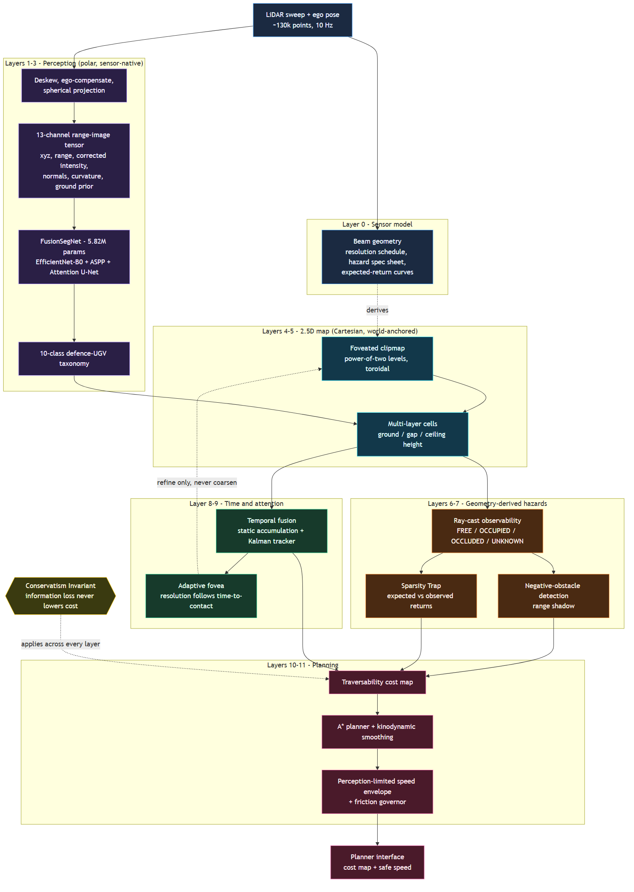


### Main design points

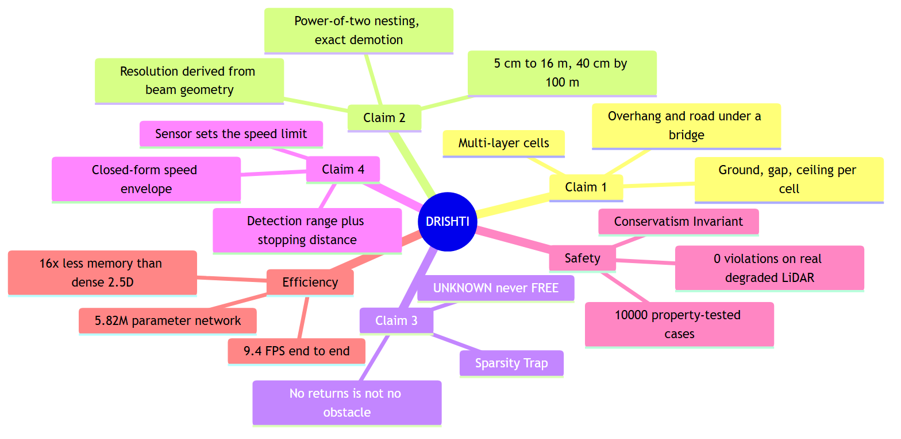


### 3D to 2.5D: why the map looks the way it does

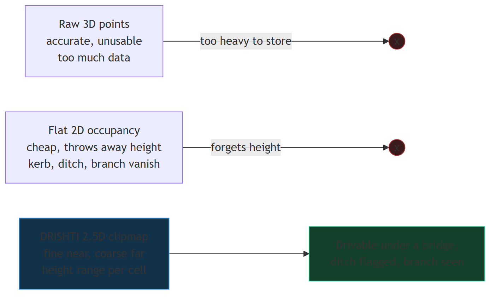


### Resolution follows the sensor, not a guess

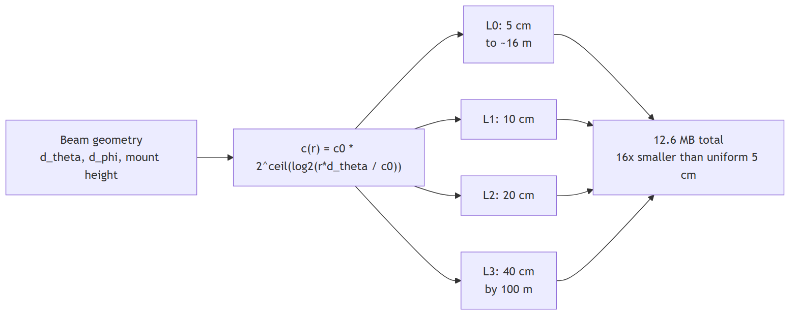


### Sparsity Trap decision logic

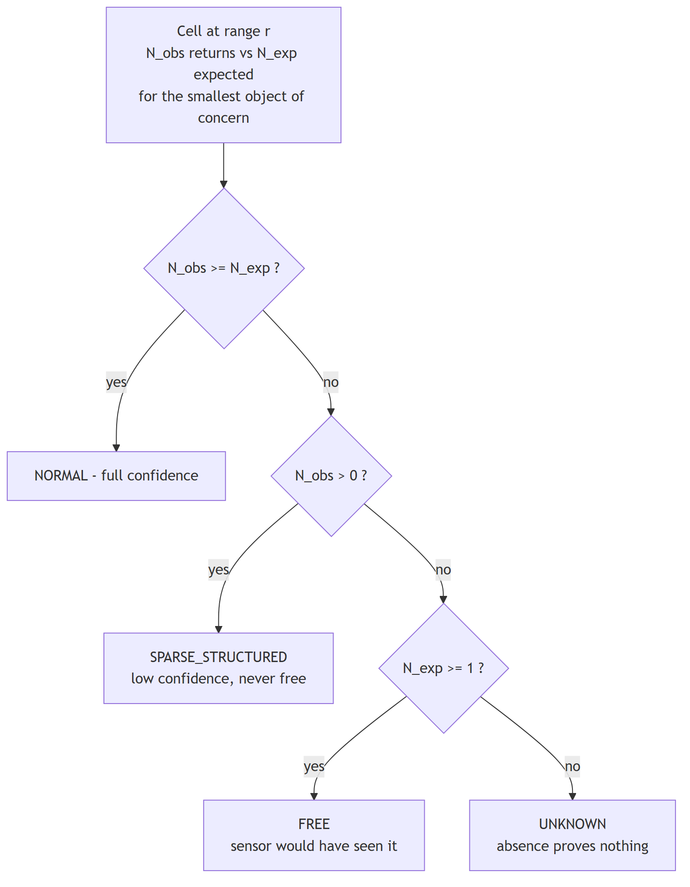


### From detection to speed

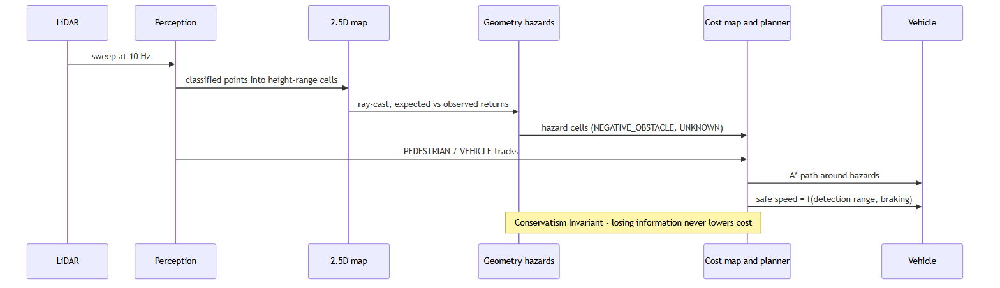


### Model architecture

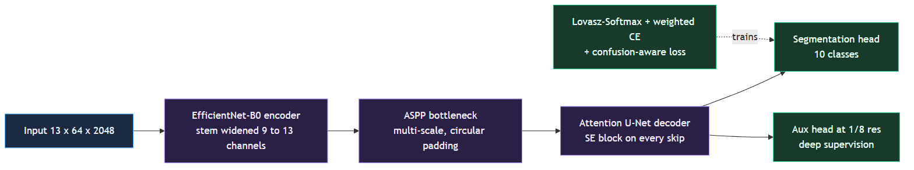


### Class taxonomy — what the planner sees

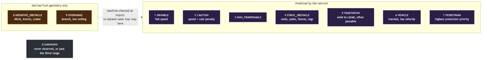


### Adaptive fovea — resolution can only get finer

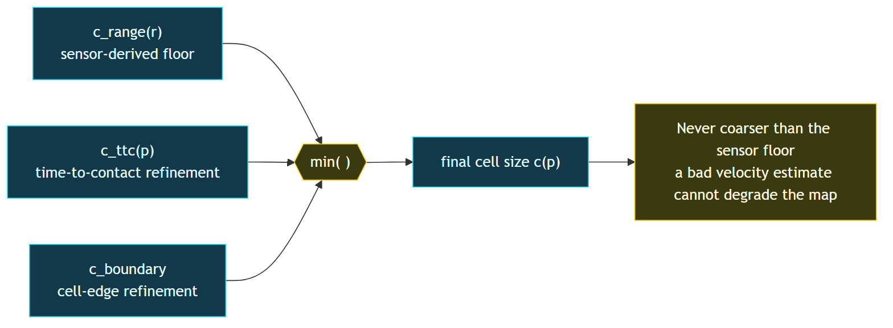


### Data and training pipeline

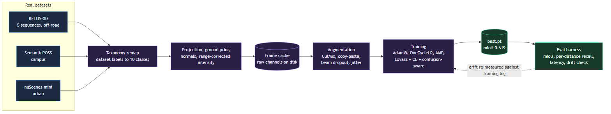


### Codebase map

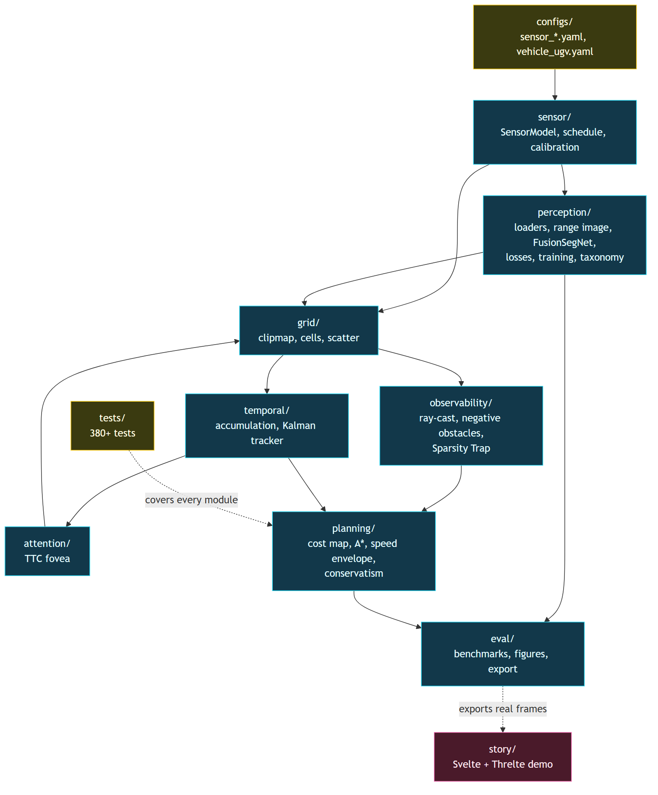


### Story demo architecture

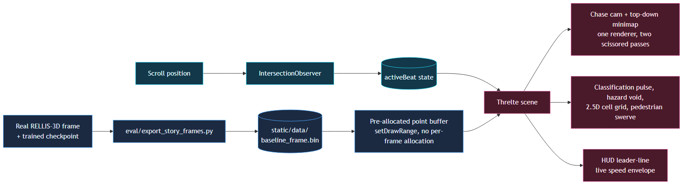


---

## Tech Stack

| Area | Technology |
|---|---|
| Language and testing | Python, pytest, Hypothesis (property-based tests) |
| Deep learning | PyTorch, EfficientNet-B0 backbone, FP16 autocast, Lovasz-Softmax loss |
| Geometry and tracking | NumPy, SciPy (Kalman filter, Hungarian association, KD-tree), Numba JIT for the ground prior |
| Sensor and datasets | Ouster OS1-64 (RELLIS-3D), Hesai Pandar40P (SemanticPOSS), Velodyne HDL-32E (nuScenes) |
| Story demo | SvelteKit, Svelte 5, Threlte, Three.js, GLSL point-sprite shaders |
| Earlier dashboard | React, react-three-fiber, Zustand |
| Diagrams | Mermaid, rendered to SVG in `docs/diagrams/` |

---

## Deep Dive: The Layers

### Layer 0: the sensor model

Every number starts from four beam-geometry quantities: azimuth step Δθ, elevation step Δφ, maximum elevation φ_max and mount height h. Spacing between neighbouring returns:

$$s_t(r) = r\,\Delta\theta \qquad s_r(r) \approx \frac{r^2\,\Delta\phi}{h} \qquad s_v(r) = r\,\Delta\phi$$

The resolution schedule is quantized onto power-of-two levels so that a coarse cell covers exactly four finer cells:

$$c(r) = c_0 \cdot 2^{\lceil \log_2 (r\Delta\theta / c_0) \rceil}, \qquad c_0 = 5\ \text{cm}$$

### Layers 4-5: the clipmap and multi-layer cells

Levels share one world origin, so a level-(l+1) cell covers exactly four level-l cells and alignment error is structurally impossible. Storage is toroidal: with N a power of two, the storage index is `i & (N-1)`, so ego motion is an index shift, not a copy. Each cell keeps a ground layer, a gap, and an optional ceiling layer, giving `clearance = z_ceiling_min - z_ground_max`. Statistics accumulate exactly with the Chan merge:

$$n = n_A + n_B,\quad \delta = \mu_B - \mu_A,\quad \mu = \mu_A + \delta\,\frac{n_B}{n},\quad M_2 = M_{2,A} + M_{2,B} + \delta^2\,\frac{n_A n_B}{n}$$

### Layer 6: negative obstacles

When the ground drops by depth d, a beam at expected range r_exp travels further; the range shadow is

$$\Delta = \frac{r_{exp}\, d}{h}$$

Detection is judged by ring-to-ring inconsistency against a locally fitted ground plane, with three-scan temporal confirmation, so crests and slopes do not raise false alarms.

### Layer 7: the Sparsity Trap

An object of extent t by w at range r should return

$$N_{exp}(r; t, w) = \frac{t\,w}{r^2\,\Delta\phi\,\Delta\theta}, \qquad r_{blind} = \sqrt{\frac{t\,w}{\Delta\phi\,\Delta\theta}}$$

With κ = N_obs / N_exp: κ >= 1 is normal; 0 < κ < 1 is SPARSE_STRUCTURED (low confidence, not free); N_obs = 0 with N_exp >= 1 is FREE (the sensor would have seen it); N_obs = 0 with N_exp < 1 is UNKNOWN. The thresholds come from the vehicle's own stated safety requirement, not from a fit.

### Layer 9: the adaptive fovea

Resolution follows time-to-contact rather than raw range:

$$\text{TTC}(p) = \frac{\lVert p\rVert}{\max(v_{close}(p),\, v_{min})}, \qquad c_{ttc}(p) = c_0\left(\frac{\text{TTC}(p)}{\tau_0}\right)^{\gamma}, \qquad c(p) = \min\big(c_{range},\, c_{ttc},\, c_{boundary}\big)$$

Taking the minimum means every extra term can only make a cell finer; the sensor-derived schedule is a hard floor.

### Layer 11: the perception-limited speed envelope

Stopping distance is d_stop = v·t_react + v² / (2a). Setting d_stop equal to the detection range R:

$$v_{max}(R) = -a\,t_{react} + \sqrt{a^2 t_{react}^2 + 2aR}$$

The vehicle's safe speed is set by the shortest detection range among the hazards the terrain can plausibly contain.

### The Conservatism Invariant

$$\text{cost(FREE)} \le \text{cost(known rough)} \le \text{cost(UNKNOWN)} \le \text{LETHAL}, \qquad E' \sqsubseteq E \;\Rightarrow\; \text{cost}(E') \ge \text{cost}(E)$$

Fourteen distinct information-deficit paths (never observed, occluded, sparse, provisional, stale, and so on) all resolve in the same cautious direction. A merge-with-prior step guarantees a fresh single-frame classification can never silently overwrite a confirmed hazard.

---

## Benchmarks

All results are measured on **RELLIS-3D** (Texas A&M off-road proving ground, Ouster OS1-64) using **all 5 sequences (00000–00004 — the complete dataset)**, 11,522 train / 2,034 validation frames, unless stated otherwise.

### Segmentation accuracy — `checkpoints_multi_v5`

| Metric | Value |
|---|---|
| **Overall mIoU** | **0.619** |
| STATIC_OBSTACLE (walls, poles, fences, logs) | **0.529** |
| VEHICLE | **0.783** |
| PEDESTRIAN | **0.798** |
| Re-measurement vs. training log (drift check, full val set) | identical to 4 decimals |

### How it compares

| Network | Parameters | Input | Published mIoU (SemanticKITTI) |
|---|---|---|---|
| SalsaNext | 6.7 M | 64×2048 range image | 55.5 % |
| FIDNet | 6.0 M | 64×2048 range image | 55.4 % |
| CENet | 6.8 M | 64×2048 range image | up to 64.7 % |
| **DRISHTI FusionSegNet** | **5.82 M — smallest** | 64×2048 range image | **61.9 % on RELLIS-3D** |

DRISHTI is the **smallest model in its class** while landing in the same mIoU band — on RELLIS-3D, an *unstructured* off-road dataset with heavy vegetation occlusion that is qualitatively harder than urban driving benchmarks. (The two datasets differ, so this is a like-for-like size and capability comparison, not a leaderboard ranking.)

### Accuracy across distance — per-class recall (150 real validation frames)

| Class | 0–10 m | 10–20 m | 20–30 m | 30–50 m |
|---|---|---|---|---|
| DRIVABLE | 77.4 % | 94.2 % | 98.2 % | 96.5 % |
| VEGETATION | 97.1 % | 98.1 % | 98.3 % | 97.8 % |
| VEHICLE | — | 89.7 % | 93.2 % | — |
| PEDESTRIAN | 89.0 % | 83.2 % | 75.9 % | 82.7 % |

### Latency — single-GPU, per real frame, 200-frame benchmark

| Stage | Before | After |
|---|---|---|
| Ground prior (Numba JIT, bit-exact vs. reference) | 117.2 ms | **25.8 ms** (4.5×) |
| Range-image tensor assembly | 24.9 ms | **11.8 ms** |
| Network forward pass (FP16 autocast, 99.90 % argmax agreement) | 50.5 ms | **23.9 ms** (2.1×) |
| **End-to-end** | **239 ms (4.2 FPS)** | **106 ms (9.4 FPS)** |

### Memory

Foveated clipmap: **12.58 MB** vs. **201.3 MB** for a dense uniform 2.5D grid at the same extent — an honest **16×** reduction (quoted against a realistic dense 2.5D baseline, not a 3D strawman).

### Physics validated by measurement

Hazard detection ranges predicted by the sensor model (HDL-64E configuration) were compared with measured detection rates: a 15 cm kerb was predicted at 20.2 m and measured at 18.4 m; a 2 m ditch was predicted at 21.6 m and measured at 20.6 m, **within ~10 % of theory**. The 2 m ditch degrades gradually with range, matching the Sparsity Trap's expected-return model rather than failing at a cliff.

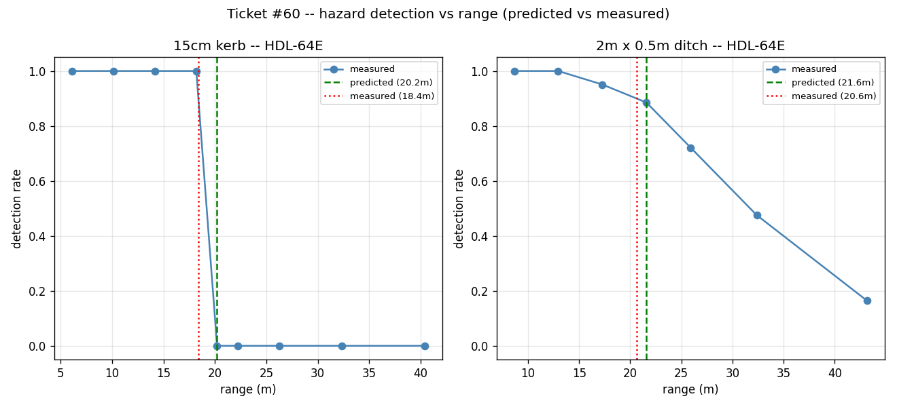

### Memory versus fidelity

Sweeping the fovea parameter gamma trades memory against elevation error, using the map's own agreement across resolution levels (no ground-truth labels needed). Almost all of the memory saving is captured immediately past gamma = 0: memory falls from about 200 MB to single-digit MB while elevation deviation stays around 1 cm at the chosen operating point.

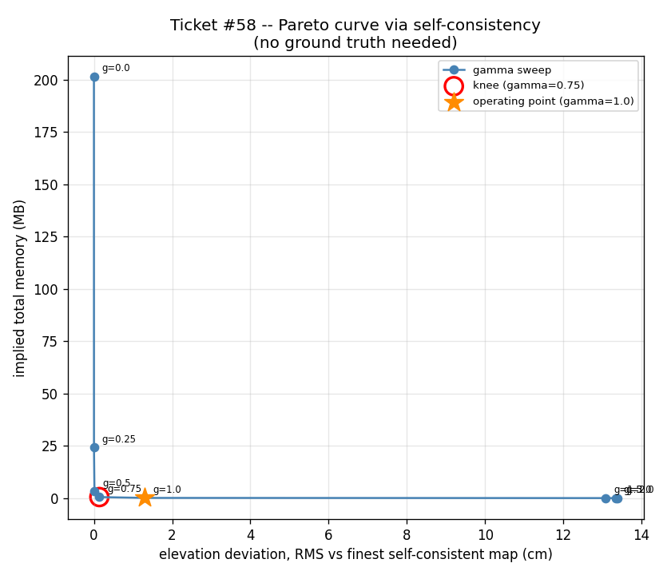

### Negative obstacle: 2D occupancy versus DRISHTI (synthetic scene)

On a synthetic sweep with a ditch, a plain 2D occupancy grid shows only a blank disc that is indistinguishable from "not yet observed", while DRISHTI's negative-obstacle pipeline flags the ditch cells.

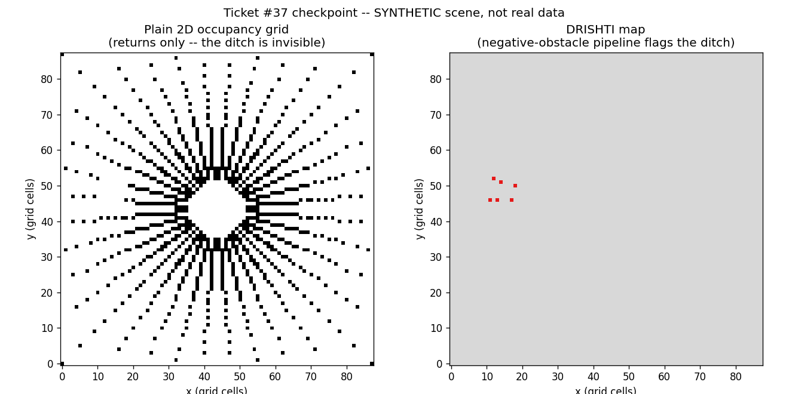

### Tracking on a real continuous sequence

200 contiguous frames of RELLIS-3D sequence 00000 through the Kalman tracker (real world-frame ego-pose compensation): 83 tracks created, up to 13 simultaneously confirmed, confirmed-track speed mean 0.55 m/s — ego motion cancels correctly, with no runaway-velocity artifacts.

### Cross-dataset generality

The same architecture adapts to other sensors and environments with small fine-tunes:

| Dataset / sensor | Result |
|---|---|
| SemanticPOSS (Hesai Pandar40P, campus) | **0.579 mIoU**; PEDESTRIAN 0.576; DRIVABLE 0.811 |
| nuScenes-mini (Velodyne HDL-32E, urban) | **0.739 DRIVABLE IoU** after a 5-minute fine-tune |

The model natively accepts different beam counts and resolutions (32-, 40-, 64-beam sensors) without architectural changes.

---

## Positioning against prior art

- **Negative-obstacle detection** builds on the *range-shadow* cue pioneered by NASA JPL for DARPA Demo III and fielded on TerraMax in the 2005 DARPA Grand Challenge, and still the active technique in 2024 literature. DRISHTI adds what that fixed-resolution, pre-deep-learning work lacked: a **sensor-derived variable-resolution map**, a **fused deep segmentation network**, the **Sparsity Trap** conservatism default, and an **open, tested, reproducible pipeline**.
- **DARPA RACER** independently found that dense semantic classification adds enough latency to mislead planners at 7–10 m/s — exactly the failure mode DRISHTI's variable-resolution mapping and perception-limited speed envelope are designed around.
- **DRDO's currently documented UGVs** (Daksh, Muntra) are teleoperated / waypoint-autonomous; adaptive-resolution 2.5D mapping with geometry-based negative-obstacle reasoning is a capability-level step beyond what is publicly documented.

---

## Interactive story demo

`story/` is a scroll-driven 3D walkthrough (SvelteKit + Threlte / Three.js) that plays the pipeline on **real exported RELLIS-3D data**: the raw sweep, the 3D→2.5D cell conversion, the classification pulse on a detected hazard, the HUD readout of the live speed envelope, a pedestrian-avoidance lane change, and a chase-cam + top-down minimap. No backend required — it reads pre-baked static files.

```bash
cd story
npm install
npm run dev          # http://localhost:5174
```

Regenerate the real frame it displays:

```bash
python -m eval.export_story_frames --sequence-dir data/rellis/00000 --frame 50
```

`frontend/` is the earlier React dashboard.

---

## Project Structure

```
sensor/         SensorModel, resolution schedule, extrinsic calibration
perception/     loaders (RELLIS-3D, nuScenes, SemanticPOSS), range image, FusionSegNet,
                losses, training, taxonomy, ground prior, TTA
grid/           clipmap, addressing, cells, scatter, temporal occupancy
observability/  ray-cast, four-state grid, negative obstacles, Sparsity Trap
temporal/       static accumulation, motion, Kalman entity tracker
attention/      time-to-contact fovea controller
planning/       traversability, cost map, A*, speed envelope, friction, conservatism
eval/           metrics, benchmarks, latency, detection-vs-range, figures (eval/out)
configs/        sensor_*.yaml, vehicle_ugv.yaml
tests/          380+ pytest tests, one file per module
story/          scroll-driven 3D story demo (Svelte + Threlte)
frontend/       React dashboard
```

---

## Installation

```bash
git clone <this-repo-url> drishti
cd drishti
pip install -r requirements.txt
```

Datasets: **RELLIS-3D** (all 5 sequences, `scripts/download_rellis.sh`), plus optional **nuScenes-mini** (`NUSCENES_DATAROOT`) and **SemanticPOSS** for the cross-dataset results.

Every sensor number lives in `configs/*.yaml` and every vehicle number in `configs/vehicle_ugv.yaml` — nothing is hardcoded, so swapping the sensor regenerates the whole map schedule.

---

## Testing

```bash
pytest -q                                              # full suite (380+ tests)
pytest -q tests/test_conservatism.py                   # Conservatism Invariant, 10,000 generated cases
pytest -q tests/test_ground_prior_numba_equivalence.py # JIT ground prior is bit-identical to the reference
pytest -q tests/test_tta.py                            # test-time augmentation correctness
```

Sensor and vehicle constants are guarded by a repo-wide test (`tests/test_vehicle_config.py`) that fails if a config value appears as a literal anywhere outside `configs/`.

---

## Glossary

| Term | Meaning |
|---|---|
| 2.5D map | A 2D grid where each cell stores height information; cheaper than 3D, richer than occupancy |
| Foveation | Allocating detail non-uniformly, finest where it matters |
| Range image | A LiDAR scan laid out as an image indexed by (beam ring, azimuth), the sensor's native layout |
| Clipmap | A stack of nested power-of-two-resolution grids centred on the viewer |
| Toroidal addressing | Indexing a fixed array with wrap-around so a moving window costs an index shift, not a copy |
| Deskew | Correcting for vehicle motion during one LiDAR rotation |
| Lovasz-Softmax | A convex surrogate for IoU; optimises mIoU directly |
| Negative obstacle | A hazard below the ground plane (ditch, trench, crater) invisible to 2D occupancy grids |
| Range shadow | The extra distance a beam travels when the ground drops away |
| Sparsity Trap | A thin object at range returning too few points to distinguish from noise |
| TTC | Time-to-contact: how long until the vehicle reaches a point at current closing speed |
| PROVISIONAL | A cell inherited from a coarser level, usable for coarse routing only |
| Conservatism invariant | Degrading a cell's evidence can never lower its reported cost |
| Perception-limited speed | Fastest speed at which stopping distance still fits inside detection range |

---

## Documentation

- [`DRISHTI_MASTER_BIBLE.md`](DRISHTI_MASTER_BIBLE.md) — full theory, architecture, training history and results
- `DRISHTI_Build_Map.md` — ticket-by-ticket build order and acceptance criteria
- `HANDOFF.md` — session-by-session build log
- `eval/out/` — figures behind every benchmark above

---

<div align="center">

**Team Chole Bhature** · Smart India Hackathon 2026 · DRDO PS 26053

</div>
